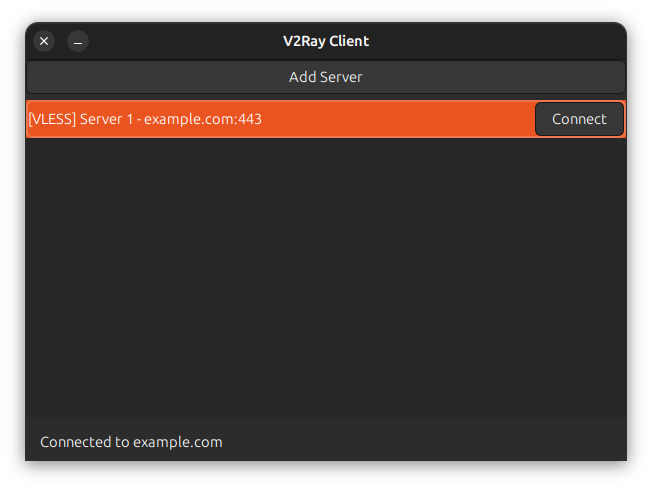

# V2Ray Client GUI



A modern cross-platform GUI client for managing V2Ray proxy connections with intuitive interface and advanced features.

## ✨ Features

- **Multi-protocol Support**
  - ✅ VMESS, VLESS, Trojan, Shadowsocks
  - 🔄 Automatic protocol detection
- **Server Management**
  - 📋 Organized server lists
  - 🏷️ Custom server labels
  - ⚡ Quick connect/disconnect
- **Connection Tools**
  - 📊 Real-time traffic monitoring
  - 🏓 Latency testing
  - 🔄 Connection speed test
- **User Experience**
  - 🎨 Dark/Light themes
  - 🖱️ Context menus
  - 📁 Config import/export

## 🛠️ Installation

### Linux (Debian/Ubuntu)

```bash
# Install system dependencies
sudo apt update
sudo apt install -y \
    python3-pip \
    python3-dev \
    python3-gi \
    python3-gi-cairo \
    gir1.2-gtk-3.0 \
    libgirepository1.0-dev \
    libcairo2-dev

# Install Python packages
pip install --user -r requirements.txt

# Download Xray-core binary
mkdir -p ~/.local/bin
wget https://github.com/XTLS/Xray-core/releases/latest/download/Xray-linux-64.zip -O xray.zip
unzip xray.zip xray -d ~/.local/bin/
chmod +x ~/.local/bin/xray
rm xray.zip
```

### Windows
- Install Python 3.8+ from python.org
- Install GTK3 runtime from gtk.org
- Run in Command Prompt as Administrator:


```cmd
pip install -r requirements.txt
wget https://github.com/XTLS/Xray-core/releases/latest/download/Xray-windows-64.zip -O xray.zip
tar -xf xray.zip xray.exe
del xray.zip
```

### macOS (Homebrew)
```bash
# Install dependencies
brew install python gtk+3 adwaita-icon-theme

# Create virtual environment
python3 -m venv venv
source venv/bin/activate

# Install Python packages
pip install -r requirements.txt

# Install Xray-core
brew install xray
```

### Verification
After installation, verify everything works:

```bash
python src/main.py --version
xray --version
```